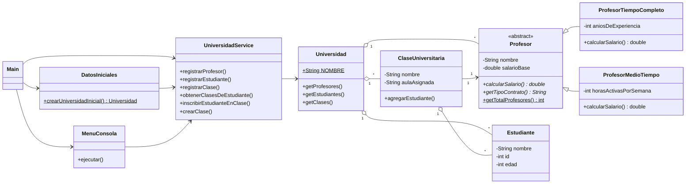

# Diagrama de diseño

```mermaid
classDiagram
    direction LR

    class Main
    class MenuConsola {
        +ejecutar()
    }

    class UniversidadService {
        +registrarProfesor()
        +registrarEstudiante()
        +registrarClase()
        +obtenerClasesDeEstudiante()
        +inscribirEstudianteEnClase()
        +crearClase()
    }

    class DatosIniciales {
        +crearUniversidadInicial() Universidad$
    }

    class Universidad {
        +String NOMBRE$
        +getProfesores()
        +getEstudiantes()
        +getClases()
    }

    class Profesor {
        <<abstract>>
        -String nombre
        -double salarioBase
        +calcularSalario() double*
        +getTipoContrato() String*
        +getTotalProfesores() int$
    }

    class ProfesorTiempoCompleto {
        -int aniosDeExperiencia
        +calcularSalario() double
    }

    class ProfesorMedioTiempo {
        -int horasActivasPorSemana
        +calcularSalario() double
    }

    class Estudiante {
        -String nombre
        -int id
        -int edad
    }

    class ClaseUniversitaria {
        -String nombre
        -String aulaAsignada
        +agregarEstudiante()
    }

    Main --> DatosIniciales
    Main --> UniversidadService
    Main --> MenuConsola
    DatosIniciales --> UniversidadService
    UniversidadService --> Universidad
    Universidad "1" o-- "*" Profesor
    Universidad "1" o-- "*" Estudiante
    Universidad "1" o-- "*" ClaseUniversitaria
    ClaseUniversitaria "1" --> "1" Profesor
    ClaseUniversitaria "1" o-- "*" Estudiante
    Profesor <|-- ProfesorTiempoCompleto
    Profesor <|-- ProfesorMedioTiempo
    MenuConsola --> UniversidadService
```
